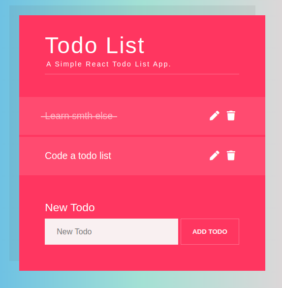
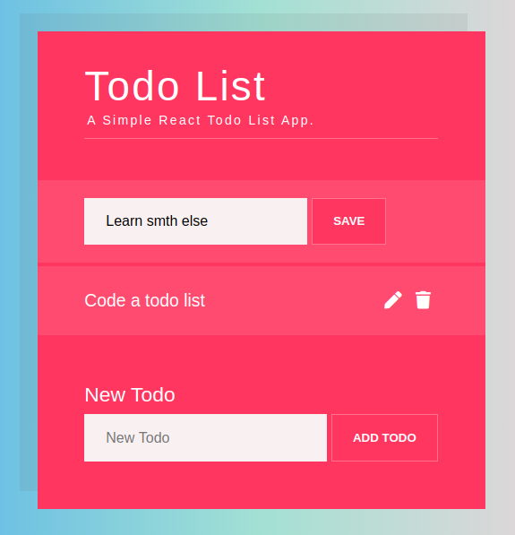

## Todo App (React)

#### App

This component renders the **TodoList** component

#### TodoList

This component renders the **NewTodoForm** component and renders the list of **Todo** component

#### NewTodoForm

This component renders a form with one text input for the task to be created. When this form is submitted, a new **Todo** component is creating

#### Todo

This component displays a **div** with the task of the todo.

Each **Todo** component has two buttons - Edit and Remove. When _Edit_ button clicked, displays a form with the task of the todo as an input and button to submit the form.

